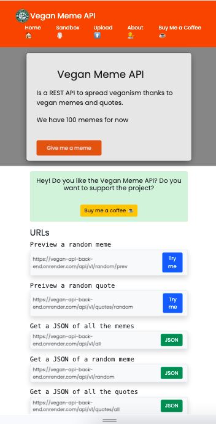
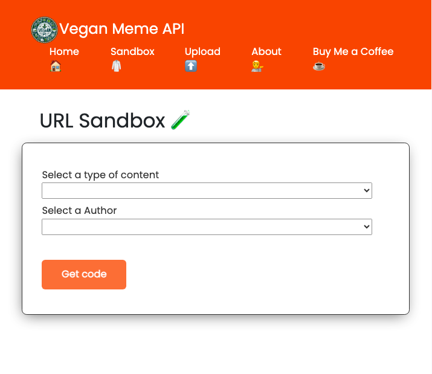
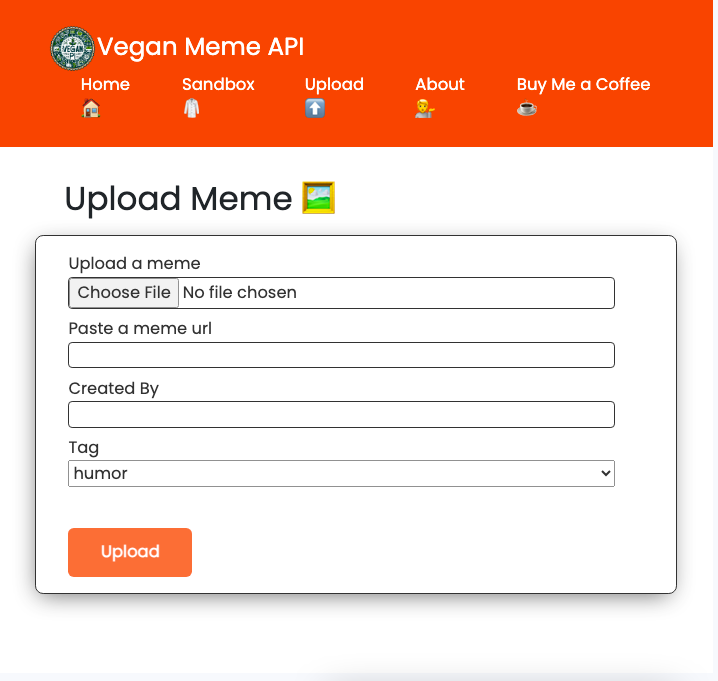
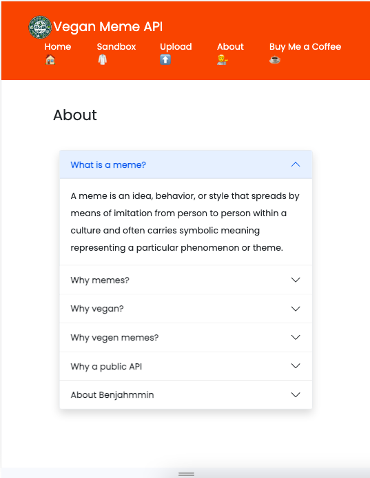
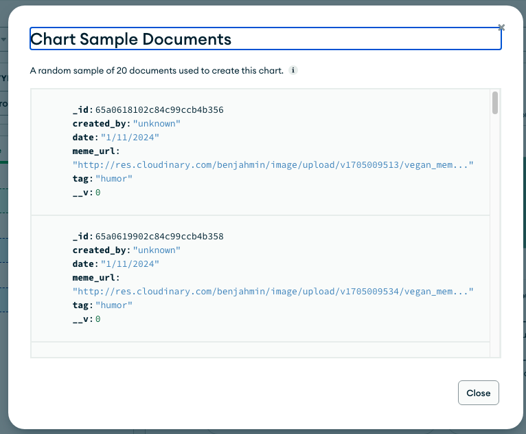

# Vegan Meme API

This is public and free API for developers or anyone to use for fetching JSON data of over a 100 vegan memes and quotes!

<div style="display:flex; justify-content:center">

</div>

## Features

- Built as a capstone project for [Per Scholas](https://www.perscholas.org) and [TekSystems](https://www.teksystems.com) React Devloper bootcamp!
- Full stack app built with MERN
- Vite / React
- Access over 100 vegan memes (and counting!)
- Access over 100 animal rights quotes
- Multiple endpoints for specific queries
- A code sandbox to test different endpoints
- a POST route for users to upload memes and add to the collection
- Connects to Cloudinary for meme storage
- Utilizes [Bootsrap](https://www.getbootsrap.com) CSS
- React Toastify for notifications
- and EmailJS for the admins to get auto notified when users upload a new meme
- No credit card, email or API key needed!

## Most API Endpoints

#### 1. Get All Quotes

- **Endpoint**: `/api/v1/quotes/all`
- **Method**: `GET`
- **Description**: Fetches all vegan quotes from the database.

#### 2. Get Quote by ID

- **Endpoint**: `/api/quotes/id/:id`
- **Method**: `GET`
- **Description**: Fetches a specific vegan quote by its ID.

#### 3. Get Quotes by author

- **Endpoint**: `/api/v1/quotes/authors/:author`
- **Method**: `GET`
- **Description**: Fetches specific vegan quote by auhor's name.

#### 4. Get all memes

- **Endpoint**: `/api/v1/all`
- **Method**: `GET`
- **Description**: Fetches all memes from databse.

#### 5. Get meme by ID

- **Endpoint**: `/api/v1/id/:id`
- **Method**: `GET`
- **Description**: Fetches a specific vegan meme by its ID.

#### 6. Get meme by tag

- **Endpoint**: `/api/quotes/tag/:tag`
- **Method**: `GET`
- **Description**: Fetches specific vegan memes by tag.

#### 6. Contribute a vegan meme

- **Endpoint**: `/api/vi/meme/add`
- **Method**: `POST`
- **Description**: Fetches specific vegan memes by tag.

## Acknowledgements

-  [Per Scholas](https://www.perscholas.org), A really cool NO COST bootcamp for career changers to break into tech!
Here is my [refereall link](https://perscholas.referralrock.com/l/WEMG997C/) if you are interested to join a training in software engineering, cyber security or IT
 - [Kasper Kain](https://www.kasperkain.com/) and [Ariel Stitt](https://www.linkedin.com/in/ariel-stitt-7b9b4211a/), my awesome teachers at Per Scholas bootcamp
 - [JavaScript Mastery MERN AI DALL-E CLone](https://www.youtube.com/watch?v=EyIvuigqDoA) tutorial
- [Cat As A Service](https://cataas.com/),  [Kevin Bailcot](https://boutdecode.fr/)'s Free API for over 1,000 cat images
 - [Cloudinary's dicord community](https://support.cloudinary.com/hc/en-us/community/posts/9456264181906-Announcing-the-new-Cloudinary-Community-and-Discord-server)


## Lessons Learned

- I learned that the order routes are coded can make a difference, which function will get precedence and which route may not even work

```
ExpressJS calculates the priority of a route based on the specificity of its path and the order by which they are declared. Routes are ordered from the most specific to the less specific one.
```

- I learned about unsigned upload presetes to use Cloudinary's API to upload images from React.
- I learned a little about using th React Syntax Highlighter library


## Screenshots

Wire frames in [Miro](https://miro.com)


Home page


Sandbox


Upload


About


MongoDB Collection


## Whats next

- Use Jest or React's testing library to write tests for the code
- Use chrome accessibility tools or Lighthouse to improve accessibilityof the API
- Refactor code to be DRYer and more organized
- Add feature to get memes dynamically rendered to size from HTTP requests
- Promote API, publish to RapidAPI and ensure that developers know about it

## Local Development

If you want to run the web app locally:

1. Clone the repository:
   ```bash
   git clone https://github.com/benjahmin-koenigsberg/vegan-api-front-end.git
   cd vegan-api-front-end

2. Install node modules and dependencies
```npm install ```
3. Run on your local server
```npm run dev```


## Contributions

Contributions are welcome! Feel free to submit issues and pull requests.
